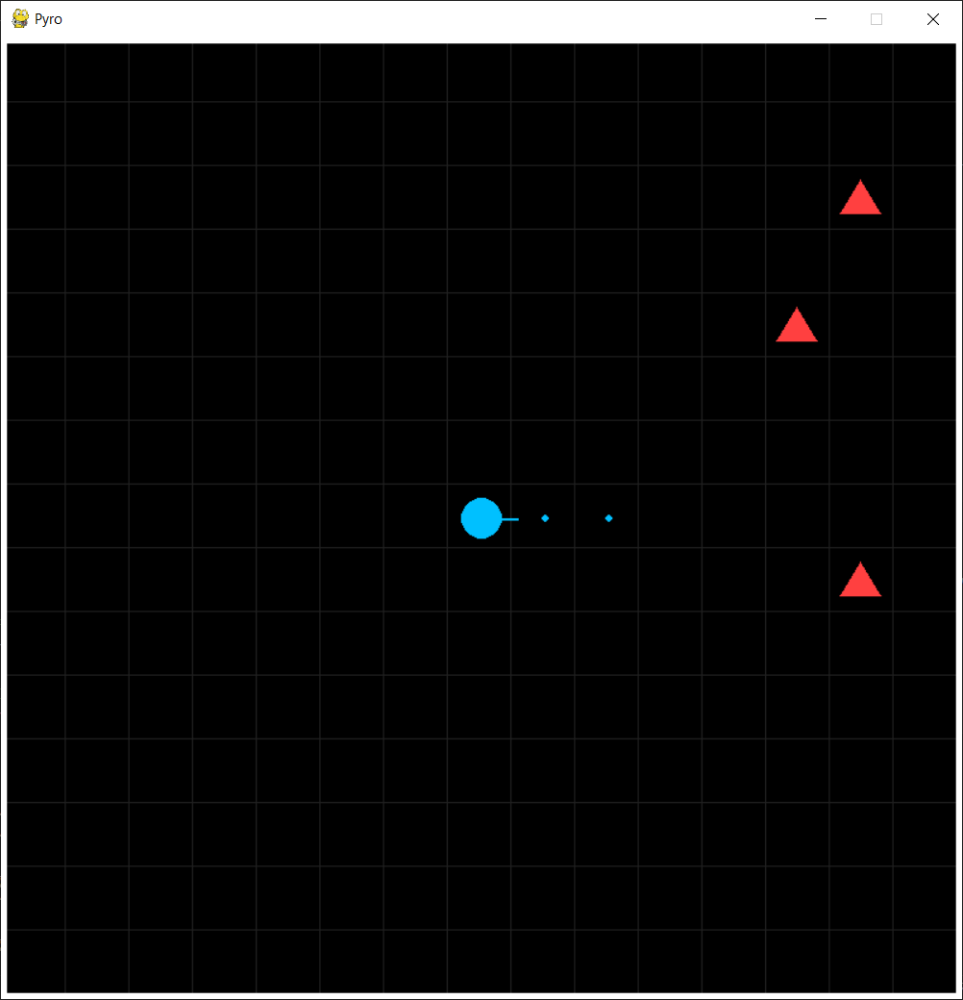

# Pyro
Simple game prototype.



## Built With

### Backend
- [Python](https://www.python.org);
- [Pygame](https://www.pygame.org);

### Virtual Environment
- [venv](https://docs.python.org/library/venv);

### Package Management System
- [pip](https://pip.pypa.io);

### Integrated Development Environment (IDE)
- [Visual Studio Code](https://code.visualstudio.com);

### AI System
- [ChatGPT](https://chat.openai.com/).

## Getting Started

### Installation
1. Install [Python](https://www.python.org/downloads/);
2. Install [Visual Studio Code](https://code.visualstudio.com/download);
3. Clone solution:
```
C:
mkdir C:\source
cd C:\source
git clone https://github.com/Simon-Charest/pyro.git
cd C:\source\pyro
```
4. Open solution with Visual Studio Code;
5. Create virtual environment:
```
python -m venv .venv
```
6. Activate virtual environment:
```
.venv\Scripts\Activate.ps1
```
7. Upgrade pip:
```
python -m pip install -U pip
```
8. Install requirements:
```
pip install -r requirements.txt
```
9. Run solution:
```
python pyro
```
10. Run tests:
```
pytest
```

## License
- Distributed under the [MIT License](https://opensource.org/license/mit/). See [LICENSE.txt](./LICENSE.txt) for more information.

## Contact
- GitHub: [Pyro](https://github.com/Simon-Charest/pyro);
- Email: [Simon Charest](mailto:simoncharest@gmail.com).
